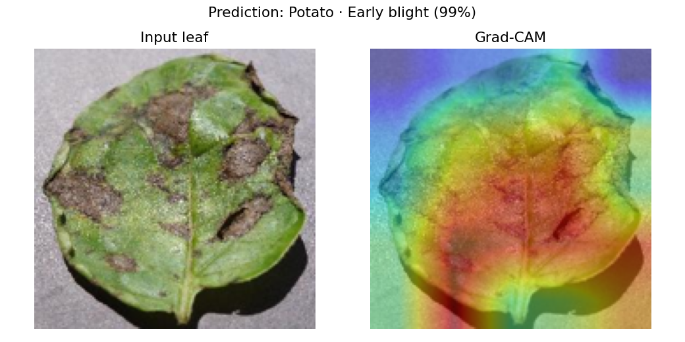
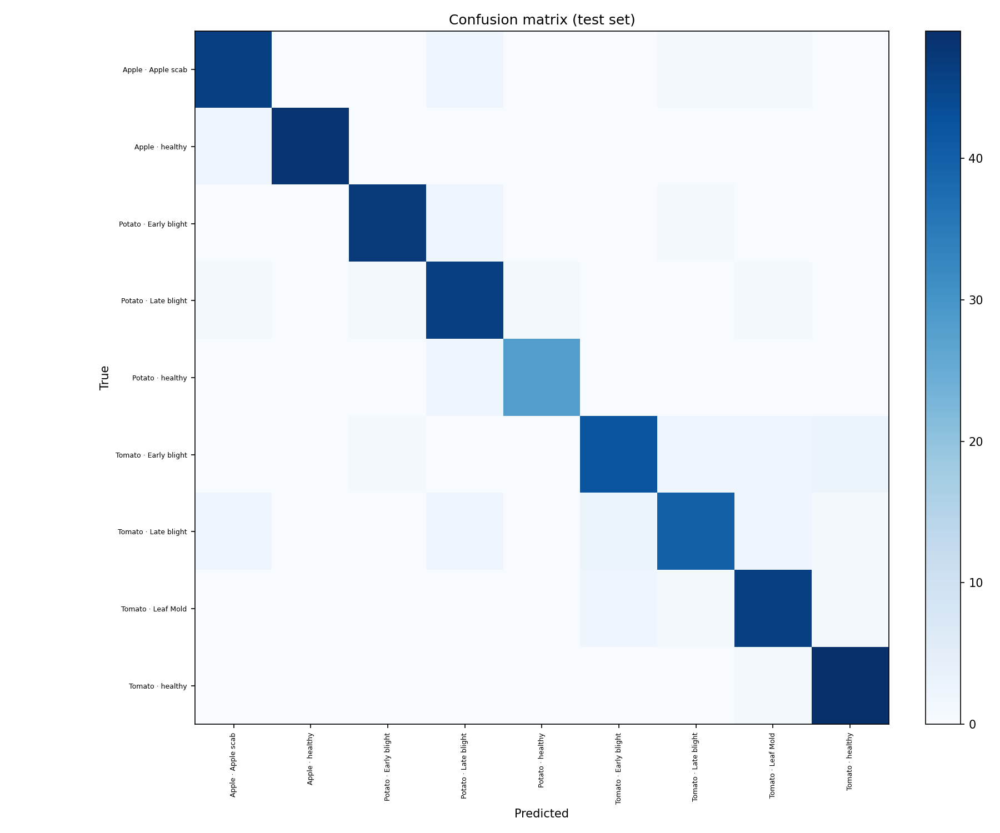

<h1 align="center">🌱 LeafDoctor — Plant Disease Classifier with Explainability</h1>

<p align="center">
  
  
  
  
  
  
</p>

End-to-end **deep-learning computer-vision** project: a convolutional network looks
at a photo of a **plant leaf** and predicts whether it is **healthy or diseased,
and which disease** (Tomato late blight, Apple scab, ...). A **Grad-CAM** heatmap
then highlights *the exact spots on the leaf* that drove the decision — so you can
see the model is looking at the lesion, not the background.

Two front-ends ship with it: an interactive **Streamlit** demo and a containerised
**FastAPI** REST service.

> Built as the computer-vision piece of my portfolio: transfer learning, data
> augmentation, model explainability and a production-style serving setup —
> **tuned to train on a plain laptop CPU**.

---

## ✨ Highlights

- **Transfer learning** from ImageNet — `mobilenet_v3_small` by default (tiny, CPU-friendly),
  with `resnet18` / `efficientnet_b0` available too.
- **⚡ Light by design.** With a frozen backbone, training uses a *feature-caching*
  path: every image passes through the network **once**, the features are cached,
  and only a small linear classifier is trained on them — epochs become near-instant.
- **Explainability** with a from-scratch **Grad-CAM** — the heatmap lands right on
  the diseased area of the leaf.
- **Reproducible**: seeded runs, stratified split, per-class cap, early stopping.
- **Served two ways**: Streamlit UI + FastAPI `/predict`, both Dockerised.
- **CI**: lint + smoke tests on every push (builds, shapes, Grad-CAM, full light run).

## 🗂️ Project structure

```
computerVision/
├── src/
│   ├── config.py        paths + hyper-parameters (light defaults)
│   ├── data.py          ImageFolder loader, augmentation, capped split
│   ├── model.py         transfer-learning model factory (3 backbones)
│   ├── gradcam.py       Grad-CAM (forward/backward hooks)
│   ├── inference.py     load checkpoint · predict · CAM overlay (shared)
│   ├── train.py         feature-caching (light) + full fine-tune paths
│   └── evaluate.py      classification report + confusion matrix
├── app/streamlit_app.py interactive demo
├── api/main.py          FastAPI service (/health, /predict)
├── tests/test_smoke.py  CPU smoke tests (incl. end-to-end light run)
├── Dockerfile · docker-compose.yml
└── .github/workflows/ci.yml
```

## 📦 Dataset

[**PlantVillage**](https://www.kaggle.com/datasets/emmarex/plantdisease) — leaf
photos labelled by crop & disease, organised as one folder per class. Put it under
`data/plantvillage/` so the structure looks like:

```
data/plantvillage/
├── Tomato___healthy/        img1.jpg ...
├── Tomato___Late_blight/    ...
└── Apple___Apple_scab/      ...
```

**Easiest — no Kaggle account needed.** A helper downloads a light subset straight
from the public GitHub mirror:

```bash
python -m src.get_data                 # 9 classes, 100 images each (~25 MB)
python -m src.get_data --per-class 60  # even lighter
```

Or, with a Kaggle token, grab the full dataset:

```bash
pip install kaggle
kaggle datasets download -d emmarex/plantdisease -p data --unzip
```

💡 **Keep it light:** you don't need all of it. A few class folders are plenty,
and `--per-class-cap` limits how many images per class are actually used in training.

## 🚀 Quickstart

```bash
# install (CPU build of torch is enough)
pip install --index-url https://download.pytorch.org/whl/cpu torch torchvision
pip install -r requirements.txt

# train — light feature-caching path, gentle on a laptop CPU
python -m src.train                     # mobilenet, frozen, 160px
python -m src.train --per-class-cap 150 # even lighter / faster

# evaluate -> per-class F1 + artifacts/confusion_matrix.png
python -m src.evaluate

# demo & API
streamlit run app/streamlit_app.py
uvicorn api.main:app --reload
curl -F "file=@leaf.jpg" http://localhost:8000/predict
```

Heavy full fine-tuning (best on a GPU, e.g. Google Colab):

```bash
python -m src.train --backbone efficientnet_b0 --unfreeze --epochs 12
```

## 📊 Results

Trained on a laptop **CPU** in a few minutes (feature-caching path), on a 9-class
subset (Tomato / Potato / Apple, healthy + diseased), ~250 images per class:

| Backbone | Mode | Val accuracy |
|---|---|---|
| MobileNetV3-Small | light (frozen) | **0.91** |
| EfficientNet-B0 | fine-tuned (GPU) | _try on Colab for higher_ |

Reproduce with `python -m src.get_data --per-class 250 && python -m src.train`.

**Grad-CAM** — the heatmap lands right on the diseased lesions:

<p align="center"></p>

<details><summary>Confusion matrix (validation set)</summary>

<p align="center"></p>
</details>

## 🧠 How it works

1. An ImageNet-pretrained **backbone** provides general visual features.
2. Its classifier is replaced with a head sized to our classes. Frozen backbone →
   features are **cached once** and only a linear head is trained (fast); or the
   whole network is fine-tuned (`--unfreeze`).
3. **Grad-CAM** weights the last conv layer's feature maps by the gradient of the
   predicted class, producing a heatmap over the most influential leaf regions.

## 🧪 Tests

```bash
pytest -q     # builds models, checks Grad-CAM, runs a full light training on fake data
```

---

<p align="center"><i>Part of <a href="https://github.com/SaltyEner">@SaltyEner</a>'s data-science / AI portfolio.</i></p>
